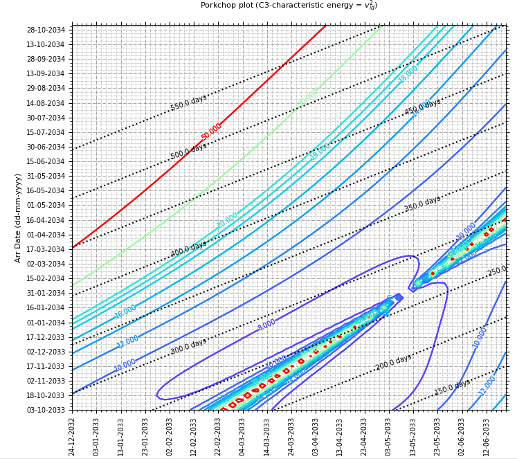
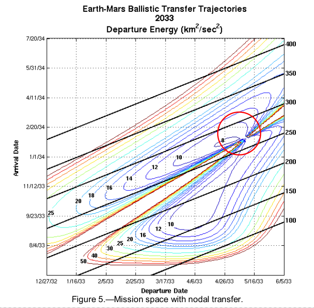
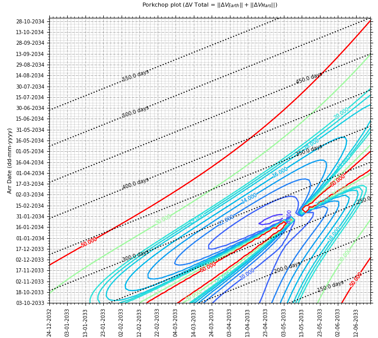

# Porkchop Plot
> Program to plot interplanetary porkchop plots for Type I and Type II trajectories.   

## Table of contents
* [General info](#general-info)
* [Screenshots](#screenshots)
* [Setup](#setup)
* [How to run ](#how)
* [Updates](#updates)
* [To-do list](#to-do)

## Screenshots
Plot generated by the script.   
      

&nbsp;         

#### Result compared with the Figure.5 in Reference.1    
      

## General info
Plotting interplanetary trajectory parameters such as C3 and V∞ in launch-date/arrival-date space and tracing isometric lines are a valuable mission design tool that are used in optimizing the trajectories for most interplanetary missions.   

Porkchop plots aide early mission designers in selecting launch dates, in calculating launch energies and ΔV budgets, and visually optimizing trajectories.   

&nbsp;         
Lambert’s Theorem is used to calculate the orbital parameters of the trajectory between any two points for a given time of flight (TOF).    
&nbsp;         
While traditional porkchop plots often portray the specific departure energy and hyperbolic excess arrival energy individually (C3 and V∞ respectively)  Here I have included the total ∆V plot as mentioned in reference.1   
∆V = V_Earth(t1) − VT(t1) + V_Mars (t2) − VT(t2)    
&nbsp;    

####Total ∆V plot for the same time span    

   

&nbsp;    

## Reference    

1.  On the Nature of Earth-Mars Porkchop Plots  
[ https://trs.jpl.nasa.gov/bitstream/handle/2014/44336/13-0679_A1b.pdf ]  

2.  Interplanetary Mission Design Handbook: Earth-to-Mars Mission Opportunities 2026 to 2045  
[ https://ntrs.nasa.gov/api/citations/20100037210/downloads/20100037210.pdf ]     

## Setup
Script is written with python (Version: 3.6) on linux. Additional modules required :   

* numpy  (tested with Version: 1.18.4 )
* matplotlib  (tested with Version: 2.1.1 )

## How to run   
* Verify and install required modules 
* run `python porkchop.py`. 

## Updates   
*   
*   *  

## To-do list
* 

